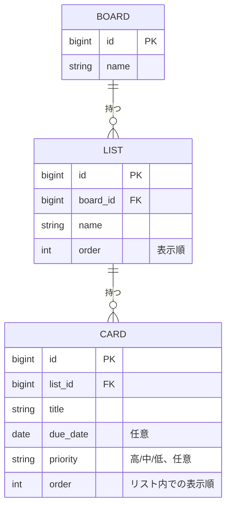

# ER図

[← 要件定義に戻る](../要件定義.md)

Trello風のデータ構造として、ボード・リスト・カードの親子関係を持つ。PostgreSQL（Docker Composeで起動、リレーショナルDB）ではJSON配列のような格納順を保持できないため、LIST・CARDそれぞれに明示的な `order`（並び順）カラムを持たせる。並べ替え・移動操作時は、この `order` 値を更新することで表示順を制御する。バックエンドはSpring Data JPAでこれらのテーブルをエンティティとしてマッピングする想定。

- BOARDは現状1件固定で運用するが、将来の複数ボード対応（[要件定義.md](../要件定義.md) の今後の検討事項を参照）を見込んでエンティティとして残す。
- 主キーはPostgreSQLの自動採番（`bigserial`／JPAの`GenerationType.IDENTITY`等）を想定する。
