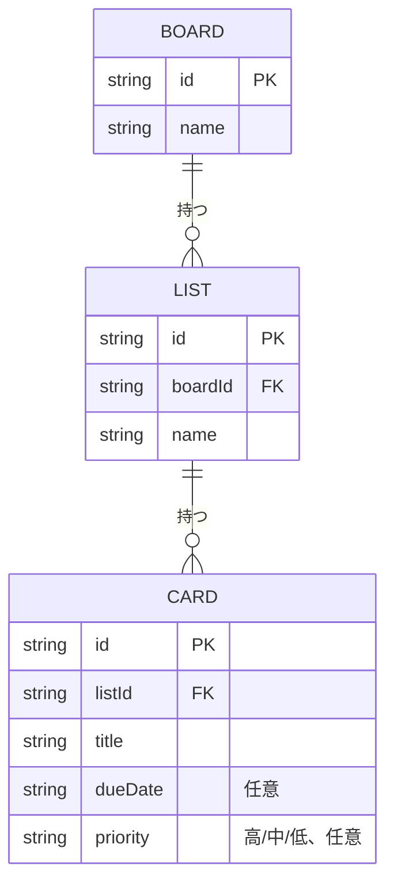

# ER図

[← 要件定義に戻る](../要件定義.md)

Trello風のデータ構造として、ボード・リスト・カードの親子関係を持つ。並び順は明示的な `order` フィールドを持たず、`localStorage` 内のJSON配列の格納順で表現する。初期状態・追加直後は作成順だが、カードのドラッグ&ドロップによる並べ替えや、リスト単位の優先度順一括並べ替え操作を行うと、この格納順自体が更新される。

- BOARDは現状1件固定で運用するが、将来の複数ボード対応（[要件定義.md](../要件定義.md) の今後の検討事項を参照）を見込んでエンティティとして残す。
