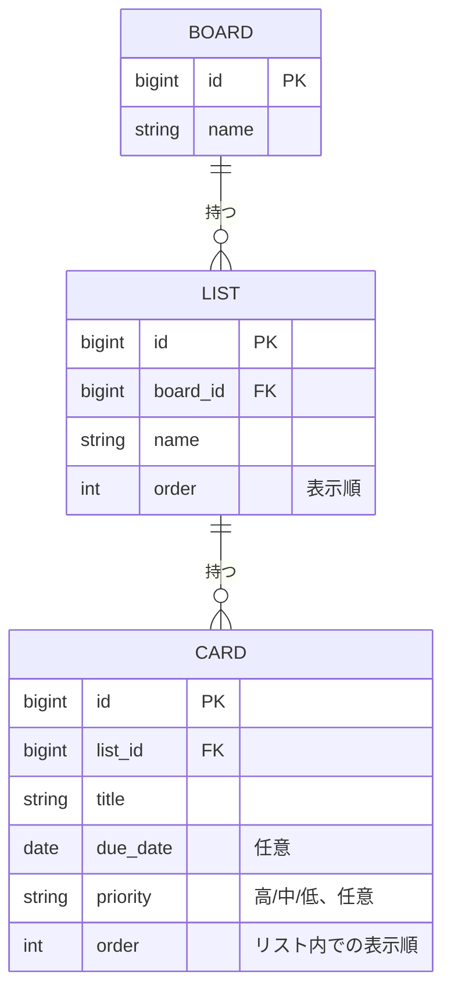

# ER図

[← 要件定義に戻る](../要件定義.md)

Trello風のデータ構造として、ボード・リスト・カードの親子関係を持つ。DBは一旦使用せず、バックエンド（Spring Boot）のインメモリ上でこの構造をJavaオブジェクトとして保持する（アプリ再起動でデータは失われる）。並び順を安定して制御するため、LIST・CARDそれぞれに明示的な `order`（並び順）フィールドを持たせる。並べ替え・移動操作時は、この `order` 値を更新することで表示順を制御する。将来DBを導入する際も、この構造をそのままテーブル設計に転用できる想定。

- BOARDは現状1件固定で運用するが、将来の複数ボード対応（[要件定義.md](../要件定義.md) の今後の検討事項を参照）を見込んでエンティティとして残す。
- 主キーはバックエンド側で発行する連番（例: `AtomicLong`によるインメモリ採番）を想定する。将来DBを導入する際は自動採番カラムに置き換える。
