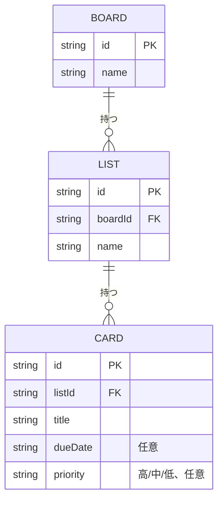

# 要件定義書 - タスク管理アプリ

Trelloを参考にした、個人用のシンプルなタスク管理アプリ。オンラインスクールの課題として開発する。

## 1. 概要

Trelloを参考にした、個人用のシンプルなタスク管理アプリを作成する。オンラインスクールの課題として開発する。

## 2. 対象ユーザー

- 開発者本人（個人利用）
- 複数人での共有・アカウント機能は想定しない

## 3. 利用環境

| 項目 | 内容 |
|---|---|
| 利用デバイス | PC（ブラウザ）のみ |
| スマートフォン対応 | 不要 |
| ログイン機能 | 不要 |
| データ保存先 | ブラウザの `localStorage`（サーバー・データベースは使用しない） |

- 単一デバイス・単一ブラウザでの利用を前提とするため、サーバーサイドの実装は不要と判断。

## 4. 機能要件

### 4.1 ボード・リスト

- ボードは **1つのみ** 管理できればよい（複数ボードの切り替えは不要）
- リストは自由に **追加・削除** できる（初期状態は「未着手」「作業中」「完了」の3つ）

### 4.2 カード

| 機能 | 内容 |
|---|---|
| カードの追加 | リストに新しいカードを作成できる |
| カードの削除 | 不要なカードを削除できる（削除前に確認あり） |
| カードの編集 | カードのタイトル・期限・優先度を後から編集できる |
| カードの移動 | カードをリスト間で移動できる（例: 未着手 → 作業中） |
| 期限の設定 | カードに締切日を設定し、表示できる（表示のみでよく、警告表示や自動並び替えは不要） |
| 優先度の設定 | 「高・中・低」の3段階で優先度を設定し、色分けして表示する |

### 4.3 データ永続化

- カードやリストの変更は `localStorage` に自動保存し、ブラウザをリロード・再訪しても内容が保持されること

## 5. 画面一覧

単一ボード・ログイン不要のため、基本は1画面（ボード画面）+モーダルという構成とする。

| No | 画面/UI名 | 種別 | 内容 |
|---|---|---|---|
| 1 | ボード画面 | メイン画面 | リスト一覧・カード一覧を横並び表示。唯一の画面。 |
| 2 | リスト追加モーダル | モーダル | リスト名を入力して追加 |
| 3 | リスト削除確認モーダル | モーダル | 「リスト内のカードもすべて削除されます」等の警告＋確認 |
| 4 | カード追加モーダル | モーダル | カードタイトルを入力して追加 |
| 5 | カード編集モーダル | モーダル | タイトル・期限・優先度を編集（追加モーダルと共通化可） |
| 6 | カード削除確認モーダル | モーダル | 削除前の確認 |

## 6. ユースケース

アクターは「個人ユーザー」の1人のみ。

| No | ユースケース名 | 概要 |
|---|---|---|
| UC1 | ボードを開く | アプリ起動時に `localStorage` から保存済みデータを読み込み、表示する |
| UC2 | リストを追加する | 新しいリスト名を入力し、ボードに追加する |
| UC3 | リストを削除する | 確認後、リストとその中の全カードを削除する |
| UC4 | カードを追加する | リストを指定してカードを新規作成する |
| UC5 | カードを編集する | 既存カードのタイトルを変更する |
| UC6 | カードを削除する | 確認後、カードを削除する |
| UC7 | カードを移動する | カードを別のリストへ移動する（例: 未着手→作業中） |
| UC8 | カードに期限を設定する | カード編集時に締切日を設定・表示する |
| UC9 | カードに優先度を設定する | カード編集時に高・中・低を設定し色分け表示する |

## 7. ER図

Trello風のデータ構造として、ボード・リスト・カードの親子関係を持つ。並び順は明示的な `order` フィールドを持たず、`localStorage` 内のJSON配列の格納順（＝作成順）で表現する。

- BOARDは現状1件固定で運用するが、将来の複数ボード対応（§10参照）を見込んでエンティティとして残す。

## 8. 非機能要件

| 分類 | 内容 |
|---|---|
| デザイン | 現状のシンプルなTrello風デザイン（白いカード、グレーのリスト背景、横並びのリスト構成）をベースとする。**背景に自然の写真を使用する**（具体的な画像は実装時に選定） |
| 対応ブラウザ | 特に指定なし（開発者本人が利用するブラウザ、最新のChrome想定で動作すればよい） |
| 性能 | カード数が数十〜百件程度でも操作にラグを感じないこと（`localStorage` ベースのため基本問題なし） |
| データ永続性 | `localStorage` の容量制限（5〜10MB程度）内で運用する。上限を超える利用は想定しない |
| 可用性 | サーバー不使用のため、ブラウザさえ開ければ常に利用可能。オフラインでも動作する |
| 保守性 | 素のHTML/CSS/JSで実装し、外部ライブラリ・ビルドツールに依存しない |
| セキュリティ | 個人利用・ローカル保存のみのため認証等は不要。ただし、カード入力値（タイトル等）は表示時にHTMLエスケープし、不正な文字列で画面が壊れることを防ぐ |

## 9. 制約条件

- 使用技術の指定なし（HTML / CSS / 素のJavaScript で実装）
- サーバー・データベースは使用しない
- **提出期限: 2026年8月16日（日）ごろまで**（今週中）

## 10. 今後の検討事項（本要件には含まないが、将来拡張の可能性があるもの）

- 複数デバイス間でのデータ同期（スマートフォン対応）
- ログイン・ユーザーアカウント機能
- 複数ボードの管理
- 期限切れカードの警告表示、期限順の自動並び替え
- カードのドラッグによる手動並び替え（`order` フィールドの導入）

## 11. 実装状況まとめ

- [ ] カードの追加
- [ ] カードの削除
- [ ] データの永続化（localStorage）
- [ ] カードの編集
- [ ] カードのリスト間移動
- [ ] 期限の設定・表示
- [ ] 優先度（高・中・低）の設定・色分け表示
- [ ] リストの自由な追加・削除
- [ ] 背景に自然の写真を設定
